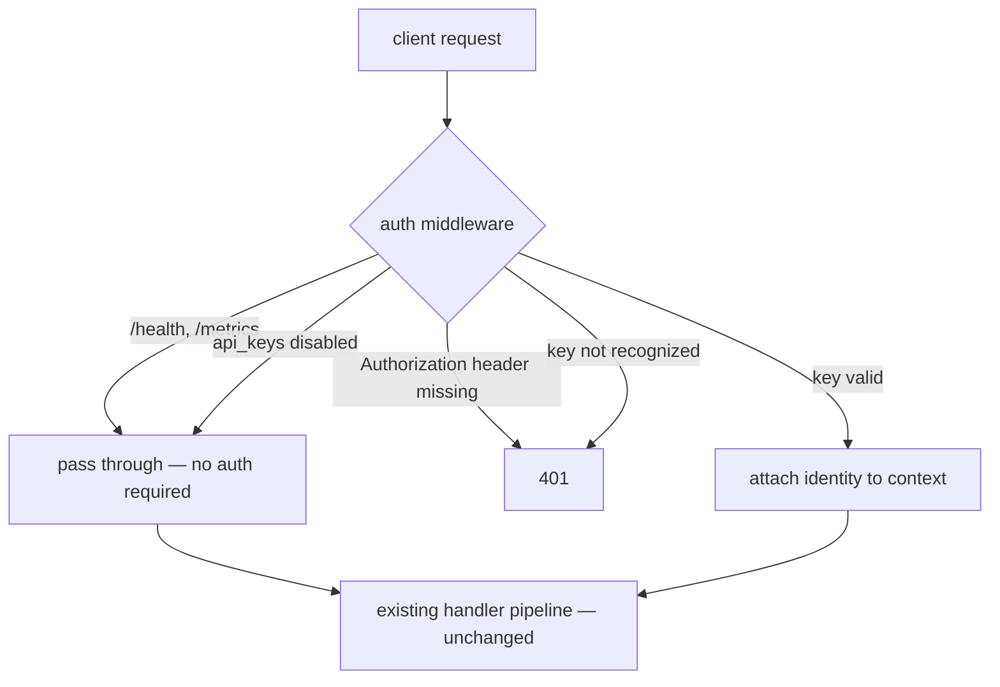

# Virtual API Keys

The gateway supports virtual API keys -- gateway-issued bearer tokens that identify clients and optionally restrict what they can access. These are "virtual" because they are not upstream provider keys; they are managed entirely by the gateway.

Clients send the key in the standard `Authorization: Bearer <key>` header, matching the convention used with OpenAI and other providers. Existing tools (Open WebUI, LiteLLM clients, curl scripts) work without changes beyond configuring a key.

## Configuration

Keys are defined in the gateway config file. Each key has a name (for logging and attribution), a secret value, and optional constraints.

```yaml
api_keys:
  enabled: true
  keys:
    - name: alice
      key: "sk-gw-abc123..."
      allowed_models: ["claude-*", "gpt-*"]
      allowed_routes: ["coding", "general"]

    - name: bob
      key: "sk-gw-def456..."
      allowed_models: ["llama3", "qwen3-vl:*"]

    - name: ci-pipeline
      key: "sk-gw-xyz789..."
      allowed_models: ["*"]
```

When `api_keys` is omitted or `enabled: false`, the gateway behaves as before -- no authentication required, open access.

Keys support environment variable substitution, matching the pattern used for upstream provider keys:

```yaml
keys:
  - name: alice
    key: "${ALICE_API_KEY}"
```

## Key Format

Keys use the prefix `sk-gw-` to distinguish them from upstream provider keys (OpenAI `sk-`, Anthropic `sk-ant-`). The prefix is a convention, not enforced by the gateway. Generate keys with the CLI:

```bash
llm-gateway genkey
# sk-gw-a1b2c3d4e5f6...
```

Keys are stored as plaintext in the config file, consistent with how upstream API keys are stored.

## Authentication Flow



## Model Restrictions

Each key can specify `allowed_models` as a list of glob patterns (e.g. `claude-*` matches any Claude model). A key with `allowed_models: ["*"]` or no `allowed_models` field has unrestricted access.

Model permission is checked after the model is fully resolved (including semantic routing) but before the request is dispatched to a provider. If the resolved model doesn't match any allowed pattern, the gateway returns 403.

## Route Restrictions

When semantic routing is enabled, a key can specify `allowed_routes` to limit which semantic routes it can use. If semantic routing selects a route the key cannot access, the gateway returns 403. It does not silently reroute to a fallback.

## Error Responses

Errors follow the OpenAI-compatible format:

| Scenario | Status | Error Type |
|---|---|---|
| Missing `Authorization` header | 401 | `authentication_error` |
| Invalid key | 401 | `authentication_error` |
| Model not allowed | 403 | `permission_error` |
| Route not allowed | 403 | `permission_error` |

## Logging and Metrics

The validated key name is included in:

- **Semantic routing log lines**: `semantic routing: key='alice' method=semantic route='coding' ...`
- **Request metrics**: `key` label on `llm_gateway.requests` and `llm_gateway.request.duration`

## Not Yet Implemented

- Per-key filtering of `/v1/models` responses
- Key expiry (`expires_at`)
- Hashed key storage
- Rate limiting per key
- Dynamic key management API
